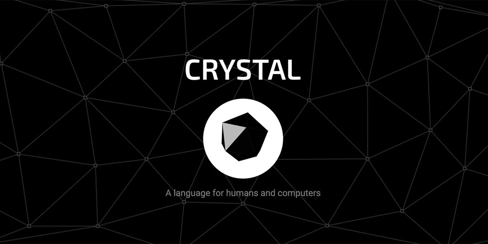

  

# Introduction 

Like most tutorials here we will be talking about the crystal programming language which is a compiled ruby syntax like programming language designed for server side development and automotive systems. This tutorial will go into data types, JSON, ECR, Classes, Modules, Methods, Method Arguments, Arrays, Loaders, Servers and finally building your own router to understand exactly how crystal works as a programming language 
